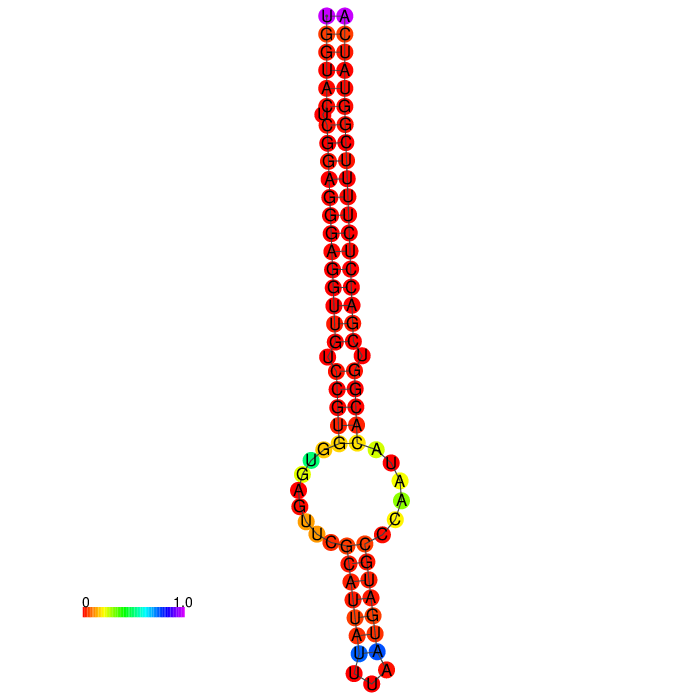

* hsa-mir-323b with [RNAfold](http://rna.tbi.univie.ac.at/cgi-bin/RNAWebSuite/RNAfold.cgi):http://rna.tbi.univie.ac.at/cgi-bin/RNAWebSuite/RNAfold.cgi
```
>hg19_wgRna_hsa-mir-323b range=chr14:101522556-101522637 5'pad=0 3'pad=0 strand=+ repeatMasking=none
TGGTACTCGGAGGGAGGTTGTCCGTGGTGAGTTCGCATTATTTAATGATGCCCAATACACGGTCGACCTCTTTTCGGTATCA
```

